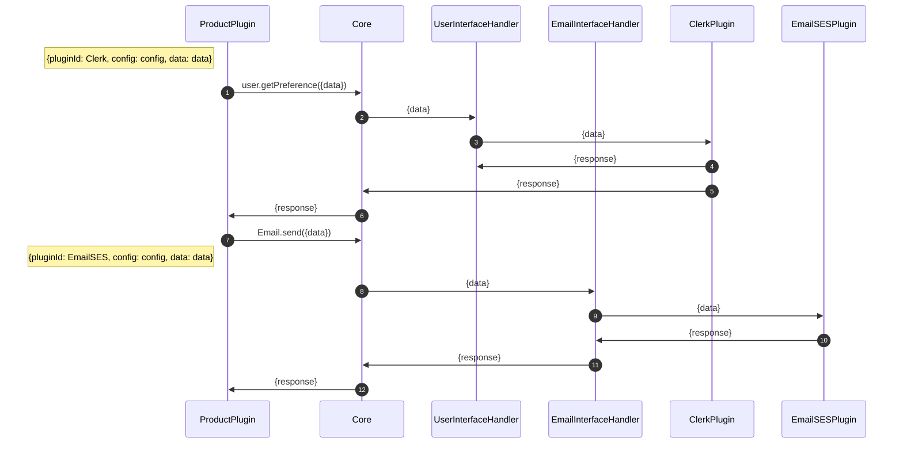
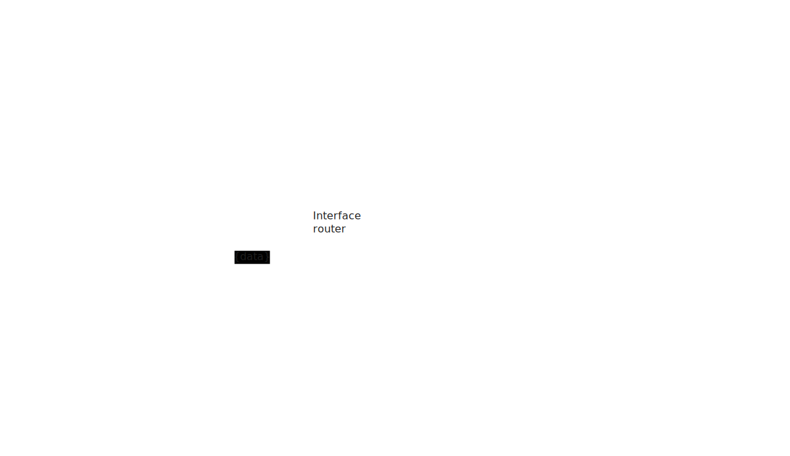
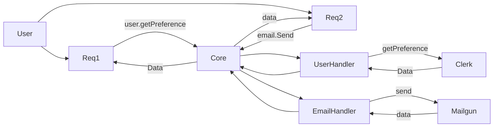

# SaaStack

## Communication between Two plugins



## Architecture





## Project Structure

The project is organized into the following main directories:

- `core/`: Core gRPC Server and HTTP Gateway.

  - `main.go`
    - Provide a way to register gRPC service
    - Provide a way to start gRPC server
    - Independent of component
  - `httpgateway.go`
    - Handles HTTP requests and acts as a gateway to the core services.

- `interfaces/`: Request router to plugin

  - Provide a way to register plugins
  - Contains logic of routing request to the specific plugin
  - Only Depend of API Specification(Proto definition)

- `plugins/`: Actual logic of plugin(Implement proto file)

- `docs/`: OpenApi spec file for each interface plugin.

- `gen/`: Generated code, likely from protobuf definitions.

- `proto/`: Protobuf definitions for each interface plugins.

## How to use SaaStack

1. Update the `config.yaml` file

```yaml
services:
  - email # Service that you will use
  - payment
plugins:
  - name: awsses
    interface: email # Service name
  - name: custom
    interface: payment
    deployment: microservice # Default: monolithic
    source: "localhost:9003"
```

Working:

> Register services to core
> Register plugins to service
> If user does not specify pluginId(while making request) then this plugin will be used as default

2. Start SaaStack core, `go run main.go`

#### Note

1. The first plugin of a service, will be used by default

2. You need to start plugins which are deploy as `microservice`.

In this repo, `plugins/{service}/custom` contains to that plugin.

To start these plugins:

Custom email: `go run plugins/email/custom/main.go`

Custom payment: `go run plugins/payment/custom/main.go`

3. When ever new plugin or service is updated, `main.go` need to be updated
